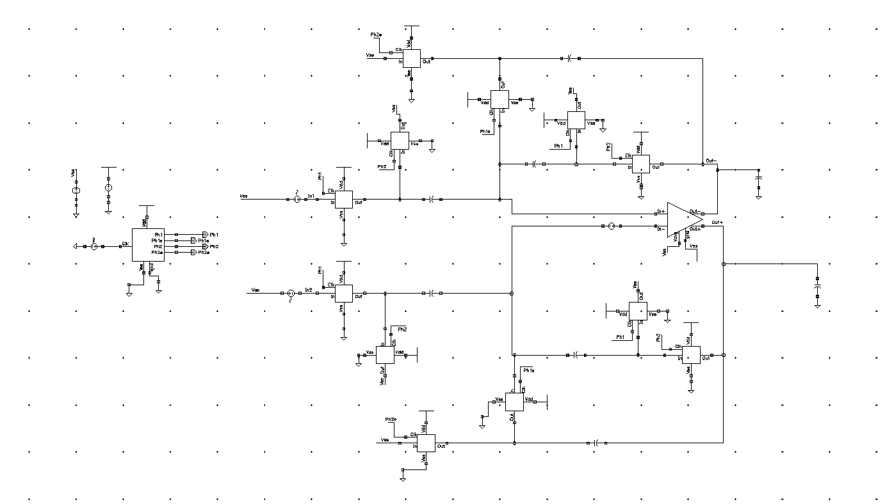
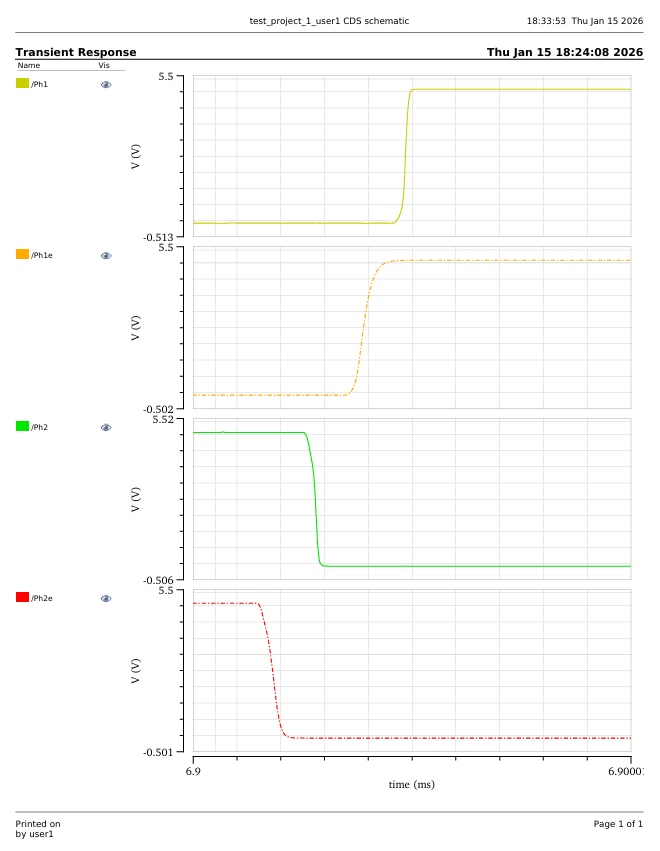
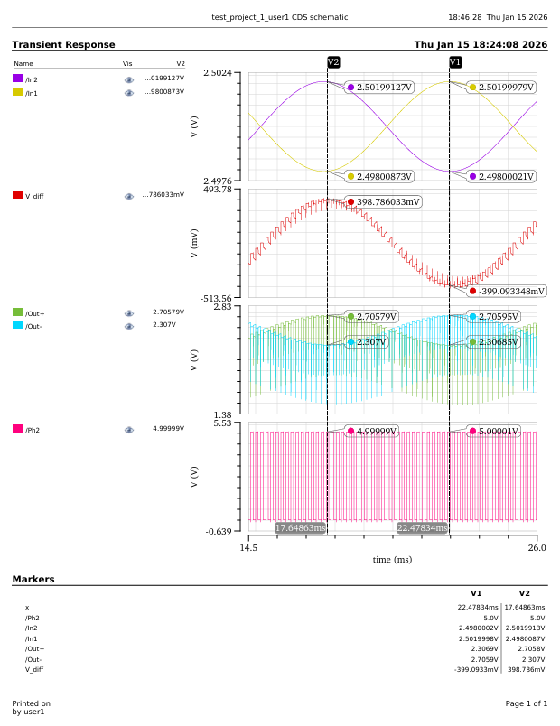

# Correlated Double Sampling (CDS) Technique for Resistive Data Acquisition

## Overview
This repository contains the design, implementation, and simulation of a Correlated Double Sampling (CDS) block. The primary objective of this architecture is to completely cancel the amplifier's inherent DC offset while simultaneously achieving a high overall voltage gain of approximately $A^2$ (where $A$ is the intrinsic gain of the core amplifier). 

Key architectural choices include a discrete-time switched-capacitor architecture implemented with **CMOS transmission gates** to minimize charge injection. The system operates under a custom-designed two-phase non-overlapping clock scheme ($\phi_1$ and $\phi_2$) to ensure glitch-free sampling and precise charge transfer.

## Specifications & Performance Metrics
The circuit was designed to ensure weak sensor inputs are adequately amplified after offset removal.

| Parameter | Achieved Performance |
| :--- | :--- |
| **Offset Cancellation** | 30 mV to 40 mV |
| **Closed-Loop Signal Gain** | ~60 dB (1000 V/V) |
| **Clock Non-Overlap Period**| 2 ns |
| **Noise Reduction** | Low-frequency $1/f$ noise cancellation |

## Principle of Operation
The core functionality relies on a distinct two-phase operation to sample and subtract errors:

* **Phase 1 ($\phi_1$):** The input voltage ($V_{IN}$) and the amplifier's DC offset are sampled onto the input capacitor $C_1$.
* **Phase 2 ($\phi_2$):** The charge is seamlessly transferred to the feedback capacitor $C_2$, effectively subtracting the stored offset from the signal path.

**Transfer Function:** The fundamental output voltage relationship is defined by the capacitor ratio, governed by the following equation:
$$V_{O1} = \frac{\Delta Q}{C_2} = \left(\frac{C_1}{C_2}\right) \cdot V_{IN}$$

## Schematics and Simulation Results

### 1. CDS Block Schematic

*The discrete-time switched-capacitor architecture utilizing CMOS transmission gates.*

### 2. Two-Phase Clock Generation

*Transient simulation of $\phi_1$ and $\phi_2$ demonstrating the precise 2 ns non-overlap period.*

### 3. Transient Response & Offset Cancellation

*Simulation demonstrating the successful cancellation of 30-40mV DC offset and an amplified output signal.*

## Tools Used
* **EDA Tools:** Cadence Virtuoso, Tanner EDA (Mentor Graphics)
* **Domain:** Analog / Mixed-Signal VLSI Design
* **Key Components:** Switched-Capacitors, CMOS Transmission Gates, Op-Amps
